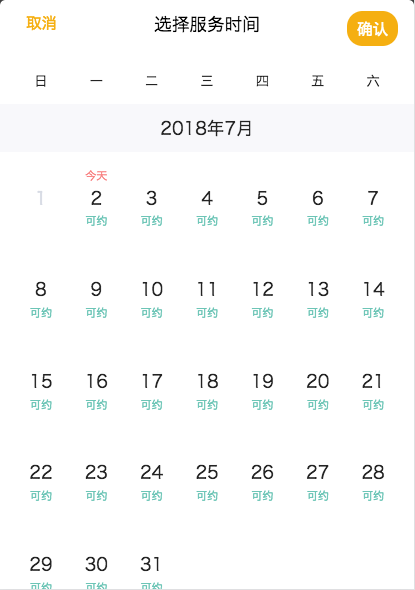

# vue-calendars

[]()
<!-- []() -->

> A simple calendar selection component based on vue.js!You can customize which day is not optional, or you can define subscripts for each day (or days). Single or multiple(/interval) choice!

## Getting Started


#### install

By npm

``` bash

npm install vue-calendars --save

```

or download code and include it

``` shell

<script src='dist/vue-calendars.js'></script>

```

## Usage

Register component globally!

``` javascript
// Your entry main.js

import Vue from 'vue'
import App from './App.vue'
import vCalendar from "vue-calendars"

Vue.use(vCalendar)
new Vue({
  el: '#app',
  render: h => h(App)
})

```
or register locally in your .vue file

## Example

``` html
<template>
  <div class="hello">
    <div class="chooseView" @click="openCalendar">
      <span class="item">选择日期：</span>
      <span class="result">开始时间：{{ selectDate[0] }}</span>
    </div>
    
    <v-calendar 
      :option="option" 
      :click-action="setSelectDate"
      :multi-selection="isMultiple"
      :interval-selection="isInterval"
      :subscript="subscript"
      :items-subscript="itemsSubscript"
    />
    
  </div>
</template>

<script>
export default {
  name: 'HelloWorld',
  data () {
    return {
      option: {
        open: false,  //是否打开日历📅；
        aroud: 12, //显示多少月的数据
        title: '选择出行日期'
      },
      selectDate: [],    //当前选择的日期
      isMultiple: false, //是否多选，false单选、true多选
      isInterval: true,   // 是否是区间选择
      subscript: "可约",  //所有的日期下标标题
      itemsSubscript:[    // 自定义哪天不可选和自定义标题
        {
          date: '2018-05-31',
          title: '不可约',
        },
        {
          date: '2018/06/01',
          title: '不可约',
        },
        {
          date: '2018,06,22',
          title: '不可约',
        }
      ]
    }
  },
  
  methods:{
    openCalendar() {
      this.option.open = true;
    },
    setSelectDate(d) {   //设置点击的日期,返回的是一个数组
      this.selectDate= d;
    }
  }
}
</script>
```

A sample screenshot is here, 



## Options

Option  | Description
---|---
option | 传入一组object aroud(当前日期),如当前日期为2018/04/25 around为3 则显示2018/04 2018/05 2018/06 3个月；open(是否显示日历)，true(显示) or false（隐藏）; title(要显示的标题), string
click-action | 选择日期之后执行的方法，可接方法名，返回的是一个包含日期的数组
multi-selection | 是否多选,true(多选) or false(单选)
interval-selection | 是否区间选择，与多选冲突，如果同时设true则按多选操作
subscript | 所有日期的下标
items-subscrip | 选择哪些日期不可选，或哪些日期的自定义下标


* 有什么问题欢迎随时提Issues！😊
